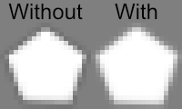

# pixelfix
Command line tool to change transparent pixels in images to use the nearest color instead of black

Modern fork of [Transparent-Pixel-Fix](https://github.com/Corecii/Transparent-Pixel-Fix) with some optimizations (bun, sharp). A rewrite is planned in something lower level, like Rust

## Comparison
Old pixelfix (jimp) takes `2.556s` to process sample.png

My pixelfix (sharp) takes `0.810s` to process sample.png

Both have exactly the same output. I did a pretty rough comparison by just doing `time` in bash before the exe path for both of them and held down enter lmfao

## Usage
Grab the latest release or build/run manually:

```sh
bun install
bun index.js
```

To package for all platforms:

```sh
# Windows
bun build --compile --minify --sourcemap --target=bun-windows-x64 index.js --outfile bin/pixelfix-windows.exe

# Linux
bun build --compile --minify --sourcemap --target=bun-linux-x64 index.js --outfile bin/pixelfix-linux

# macOS
bun build --compile --minify --sourcemap --target=bun-darwin-arm64 index.js --outfile bin/pixelfix-macos

# macOS Intel
bun build --compile --minify --sourcemap --target=bun-darwin-x64 index.js --outfile bin/pixelfix-macos-intel
```

you will download 100mb exe from releases and you will enjoy it

## More info

When saving an image file, most image editors will save completely transparent pixels as black. On some platforms, the resizing algorithm blends transparent pixels with non-transparent pixels, resulting in black edges on resized images. [Here](http://www.adriancourreges.com/blog/2017/05/09/beware-of-transparent-pixels/) is an article showing the difference and discussing techniques to fix the issue.

This script keeps those pixels transparent, but changes their color to match the nearest non-transparent pixel. This means that when the non-transparent and transparent pixels are blended, there should be no color difference.

An image with and without pixelfix applied:


###### [source](https://devforum.roblox.com/t/pixelfix-remove-the-black-edges-on-scaled-images/201802)